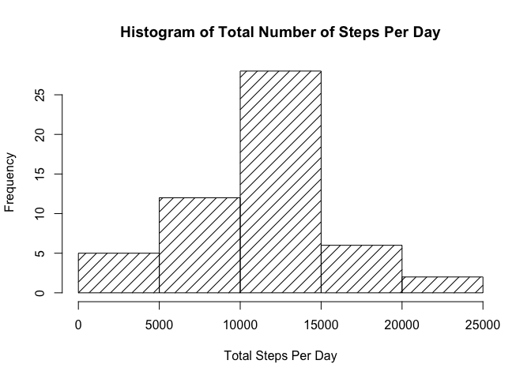
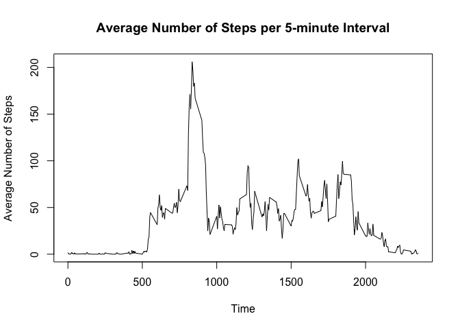
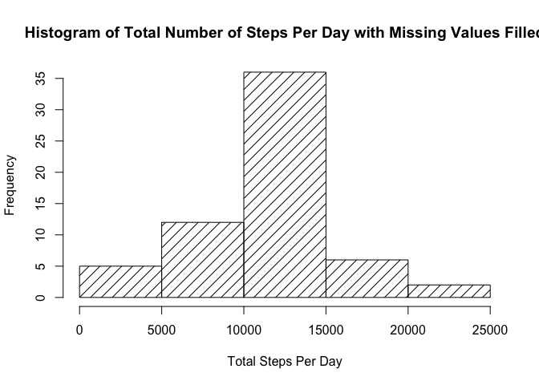
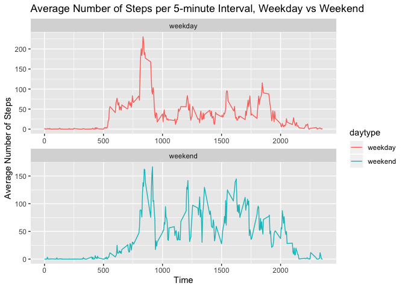

## Loading and preprocessing the data
1. Load the data
2. Process/transform the data into a format suitable for your analysis

```r
# load packages
library(dplyr)
```

```
## 
## Attaching package: 'dplyr'
```

```
## The following objects are masked from 'package:stats':
## 
##     filter, lag
```

```
## The following objects are masked from 'package:base':
## 
##     intersect, setdiff, setequal, union
```

```r
library(ggplot2)

# unzip data
unzip("./activity.zip", files = NULL, list = FALSE, overwrite = TRUE,
      junkpaths = FALSE, exdir = ".", unzip = "internal",
      setTimes = FALSE)
activity <- read.csv("./activity.csv")

# check columns
str(activity)
```

```
## 'data.frame':	17568 obs. of  3 variables:
##  $ steps   : int  NA NA NA NA NA NA NA NA NA NA ...
##  $ date    : Factor w/ 61 levels "2012-10-01","2012-10-02",..: 1 1 1 1 1 1 1 1 1 1 ...
##  $ interval: int  0 5 10 15 20 25 30 35 40 45 ...
```

```r
# make date column into Date class
activity$date <- as.Date(activity$date, "%Y-%m-%d")
```

## What is mean total number of steps taken per day?
1.For this part, ignore the missing values in the dataset.
2.Calculate the total number of steps taken per day and make a histogram
3.Calculate and report the mean and median of the total number of steps taken per day

```r
# calculate the total number of steps per day
daily_total_steps <- activity %>% group_by(date) %>% summarize(sum(steps))
names(daily_total_steps) <- make.names(c("date","total_steps"))

# plot a histogram of total number of steps per day
with(daily_total_steps, hist(total_steps, density=10, xlab = "Total Steps Per Day", ylab = "Frequency", main="Histogram of Total Number of Steps Per Day"))
```

<!-- -->

```r
# calculate mean 
mean_daily_total_steps <- mean(daily_total_steps$total_steps, na.rm=TRUE)
mean_daily_total_steps
```

```
## [1] 10766.19
```

```r
# calculate median
median_daily_total_steps <- median(daily_total_steps$total_steps, na.rm=TRUE)
mean_daily_total_steps
```

```
## [1] 10766.19
```

## What is the average daily activity pattern?
1.Make a time series plot of the 5-minute interval (x-axis) and the average number of steps taken, averaged across all days (y-axis)
2.Which 5-minute interval, on average across all the days in the dataset, contains the maximum number of steps?


```r
# calculate the mean number of steps per 5-minute interval
interval_steps <- activity %>% group_by(interval) %>% summarize(mean_steps = mean(steps, na.rm=TRUE))

# make a time series of the 5-minute interval and the average number of steps taken
with(interval_steps, plot(interval, mean_steps, type="l", xlab = "Time", ylab = "Average Number of Steps", main = "Average Number of Steps per 5-minute Interval"))
```

<!-- -->

```r
# find out the maximum
max_interval_step <- subset(interval_steps, mean_steps == max(mean_steps))
max_interval_step
```

```
## # A tibble: 1 x 2
##   interval mean_steps
##      <int>      <dbl>
## 1      835       206.
```

## Imputing missing values
Note that there are a number of days/intervals where there are missing values (coded as NA). The presence of missing days may introduce bias into some calculations or summaries of the data. This section will perform the following:
1.Calculate and report the total number of missing values in the dataset (i.e. the total number of rows with NAs)
2.Fill all of the missing values in the data set with the mean for that 5-minute interval across all days.
3.Create a new dataset that is equal to the original dataset but with the missing data filled in.
4.Make a histogram of the total number of steps taken each day and Calculate and report the mean and median total number of steps taken per day.

```r
# calculate the total number of missing values in the dataset
num_na <- is.na(activity$steps)
sum(num_na)
```

```
## [1] 2304
```

```r
# creat a new dataset that is equal to the original dataset activity2
# impute mean interval to missing values in activity2
activity2 <- activity
interval_mean <- tapply(activity2$steps, activity2$interval, mean, na.rm=TRUE, simplify=TRUE)
activity2$steps[num_na] <- interval_mean[as.character(activity2$interval[num_na])]

# check missing values in activity2
sum(is.na(activity2$steps))
```

```
## [1] 0
```

```r
# make a histogram of the total number of steps taken each day
daily_total_steps2 <- activity2 %>% group_by(date) %>% summarize(sum(steps))
names(daily_total_steps2) <- make.names(c("date","total_steps"))
with(daily_total_steps2, hist(total_steps, density=10, xlab = "Total Steps Per Day", ylab = "Frequency", main="Histogram of Total Number of Steps Per Day with Missing Values Filled"))
```

<!-- -->

```r
# calculate mean 
mean_daily_total_steps2 <- mean(daily_total_steps2$total_steps, na.rm=TRUE)
mean_daily_total_steps2
```

```
## [1] 10766.19
```

```r
# calculate median
median_daily_total_steps2 <- median(daily_total_steps2$total_steps, na.rm=TRUE)
median_daily_total_steps2
```

```
## [1] 10766.19
```

## Are there differences in activity patterns between weekdays and weekends?
1. Use the dataset with the filled-in missing values, activity2
2. Create a new factor variable in the dataset with two levels – “weekday” and “weekend” indicating whether a given date is a weekday or weekend day.
3. Make a panel plot containing a time series plot of the 5-minute interval (x-axis) and the average number of steps taken, averaged across all weekday days or weekend days (y-axis).

```r
# add new factor column weekend and weekday
activity2$daytype <- ifelse(weekdays(activity2$date) %in% c("Saturday","Sunday"), "weekend", "weekday")

# make a panel plot containing a time series plot of the 5-minute interval and the average number of steps taken, averaged across all weekday days or weekend days
interval_steps2 <- activity2 %>% group_by(interval, daytype) %>% summarize(mean_steps = mean(steps, na.rm=TRUE))
g <- ggplot(interval_steps2, aes(x=interval, y=mean_steps, color = daytype)) + geom_line() + facet_wrap(.~daytype, scales="free", ncol=1, nrow=2) + labs(x="Time") + labs(y="Average Number of Steps") + labs(title = "Average Number of Steps per 5-minute Interval, Weekday vs Weekend")
print(g)
```

<!-- -->
